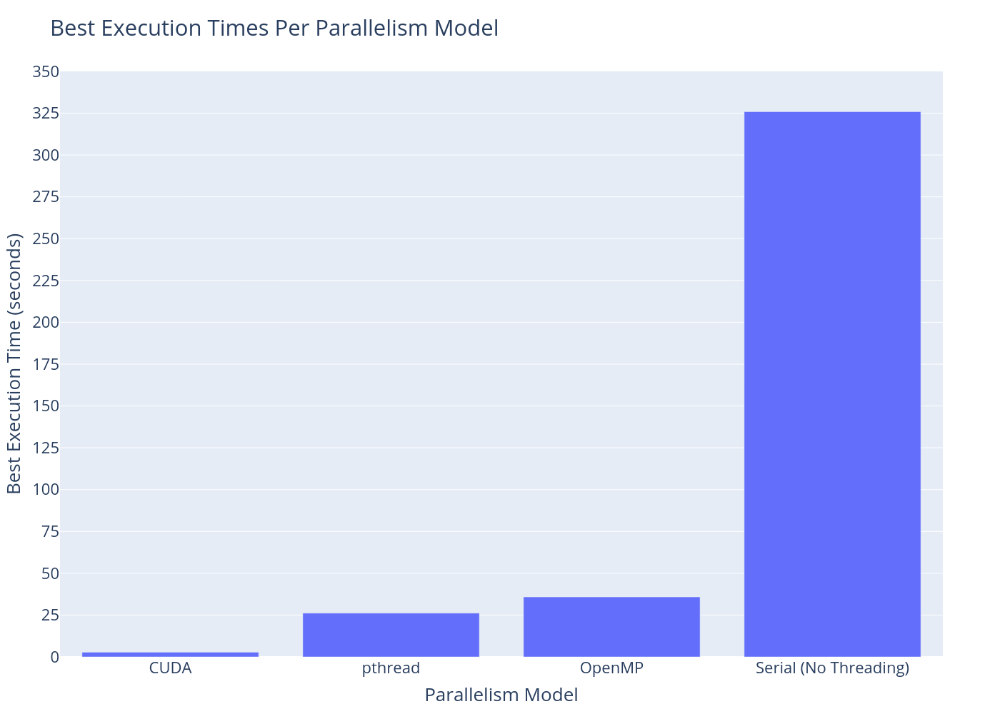

# Image Greyscaler Benchmark Results

## Input Image

- Image dimensions (pixels): `28000x28000` (`FHD == 1920x1080`)

  

- Image size (bytes): `119,828,615`

## Hardware/Software Specifications

### Hardware

#### CPU

```txt
CPU:       Info: Quad Core
           model: Intel Core i7-4790K
           bits: 64
           type: MT MCP
           arch: Haswell
           rev: 3
           cache:
              L2: 8 MiB
           flags: avx avx2 lm nx pae sse sse2 sse3 sse4_1 sse4_2 ssse3 vmx
           bogomips: 63873
           Speed: 4333 MHz
           min/max: 800/4400 MHz
           Core speeds (MHz):
              1: 4333 2: 4043 3: 4323 4: 4126
              5: 4346 6: 4282 7: 4277 8: 4339
```

#### RAM

```txt
Memory:    RAM: total: 11.54 GiB
           Array-1: capacity: 32 GiB
           slots: 4
           EC: None
           max-module-size: 8 GiB
           note: est.
           Device-1: ChannelA-DIMM0 size: No Module Installed
           Device-2: ChannelA-DIMM1 size: 4 GiB speed: 1333 MT/s type: DDR3
           Device-3: ChannelB-DIMM0 size: No Module Installed
           Device-4: ChannelB-DIMM1 size: 8 GiB speed: 1333 MT/s type: DDR3
```

#### CUDA

```txt
CUDA Device Query (Runtime API) version (CUDART static linking)

Detected 1 CUDA Capable device(s)

Device 0:
  CUDA Driver Version / Runtime Version          11.3 / 11.3
  CUDA Capability Major/Minor version number:    5.0
  Total amount of global memory:                 3998 MBytes (4192337920 bytes)
  (005) Multiprocessors, (128) CUDA Cores/MP:    640 CUDA Cores
  GPU Max Clock rate:                            1110 MHz (1.11 GHz)
  Memory Clock rate:                             2700 Mhz
  Memory Bus Width:                              128-bit
  L2 Cache Size:                                 2097152 bytes
  Total amount of constant memory:               65536 bytes
  Total amount of shared memory per block:       49152 bytes
  Total shared memory per multiprocessor:        65536 bytes
  Total number of registers available per block: 65536
  Warp size:                                     32
  Maximum number of threads per multiprocessor:  2048
  Maximum number of threads per block:           1024
  Max dimension size of a thread block (x,y,z): (1024, 1024, 64)
  Max dimension size of a grid size    (x,y,z): (2147483647, 65535, 65535)

deviceQuery
CUDA Driver = CUDART
CUDA Driver Version = 11.3
CUDA Runtime Version = 11.3
NumDevs = 1
Result = PASS
```

### Software

#### Operating System

```txt
Kernel: 5.12.14 x86_64
```

#### Compilers and Tools

- gcc:

  ```txt
  gcc (GCC) 11.1.0
  ```

- clang:

  ```txt
  clang version 12.0.1
  Target: x86_64-pc-linux-gnu
  Thread model: posix
  ```

- cmake:

  ```txt
  cmake version 3.20.5
  ```

## Algorithm

The overall algorithm of all implementation models is as the following:

1. Read the input image
2. Load the entire image into memory (RAM or GPU DRAM)
3. Start timer
4. Transform image (launch threads in multi-threaded implementation)
5. Gather results
6. Stop timer
7. Print elapsed execution time
8. Write results to output image file
9. Clean any allocated memory

## Limitations

Current implementation uses `libjpeg` for reading, manipulating, and writing jpeg images.

## Results

Results are average of _only processing time_ of executing the same implementation with different configuration parameters `2000` times:

- OpenMP

  

- pthread

  

- CUDA

  

### Speedup

The following is the best execution time of different parallelism model implementations compared in one view (+ single-threaded serial execution):


